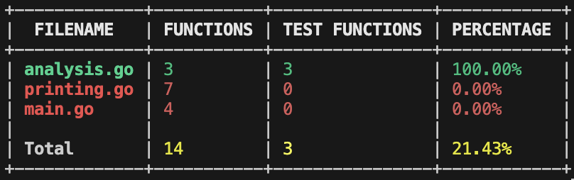

# Go Code Test Analyzer (GCTA)

Go Code Test Analyzer (GCTA) is your dedicated tool for gaining a deeper understanding of your Go codebase. Built with the Go language, GCTA navigates your Go files and provides a comprehensive snapshot of your codebase's structure, giving you visibility into the number of functions and the test coverage for each file. This clear picture of your codebase's health empowers you to maintain high-quality and well-tested code.



## Features

GCTA is packed with features designed to give you a clear and concise overview of your Go codebase:

1. **Function and Test Function Analysis:** GCTA meticulously examines each Go file in your codebase, counting both functions and test functions. This analysis equips you with valuable insights into the structure and test coverage of your code.

2. **Neat Output:** GCTA provides output in a user-friendly tabular format in the terminal, making it easy to interpret and understand the state of your codebase.

3. **Markdown Support:** For those who love documentation, GCTA supports output in markdown format. This feature allows you to easily include your codebase's structure and test coverage in your project documentation.

4. **Concurrency:** GCTA leverages Go's powerful concurrency model to efficiently analyze large codebases, saving you valuable time and resources.

## Performance
The time to analyse https://github.com/moby/moby which is ~ 300MB with 69k ".go" files took `2.44s` on a M1.
## Installation

Getting started with GCTA is straightforward:

### Using brew:

Install GCTA using brew with the following command:

```bash
brew install radurobot/gcta/gcta
```

Alternatively, you can tap into the repository first:

```bash
brew tap radurobot/gcta
brew install gcta
```

### Manual:

If you prefer a manual installation, make sure you have Go installed on your system. Then follow these steps:

1. Clone the repository:

    ```bash
    git clone https://github.com/yourusername/go-code-analyzer.git
    ```

2. Navigate to the cloned directory:

    ```bash
    cd go-code-analyzer
    ```

3. Build the project:

    ```bash
    go build -o GCTA
    ```

4. Move the `GCTA` binary to a directory in your `$PATH`:

    ```bash
    sudo mv GCTA /usr/local/bin/
    ```

## Usage

### Command Line Arguments

The tool accepts the following command line arguments:

--markdown: Generate the report in Markdown format.
--html: Generate the report in HTML format.
--latest-version: Prints the latest version of the tool fetching GitHub API.
--current-version: Print the current version of the tool.
--path: The path to the directory to analyze. Can be specified multiple times to analyze multiple directories.
--exclude: A comma-separated list of paths to exclude from analysis.

### Examples
To analyze a directory and generate a Markdown report:
    ```bash
    gcta --path . -markdown
    ```

To analyze multiple directories and exclude certain paths:
    ```bash
    gcta --path . --exclude ./cmd
    ```


To see the full list of command line arguments and their descriptions:
```bash 
gcta --help 
``` 

## License

This project is licensed under the MIT License. For more details, see the LICENSE file.

Join the world of Go with GCTA and gain a deeper understanding of your codebase today!